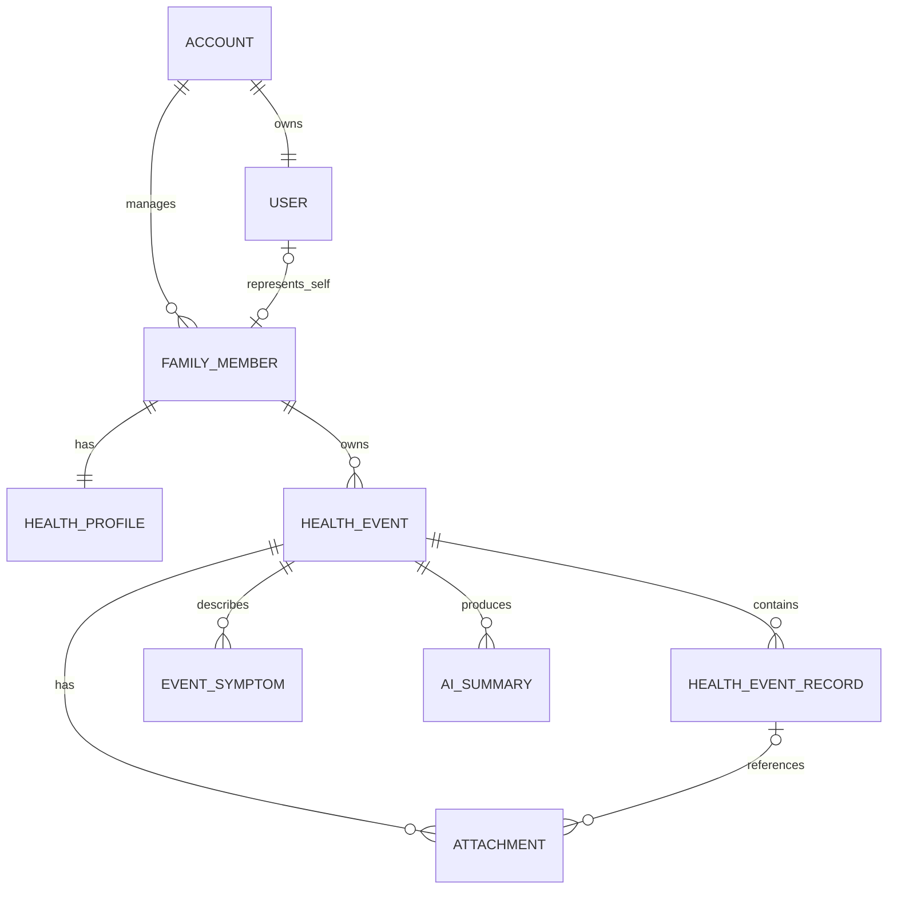

# 《Hoho 后端数据架构 V1.0 设计文档》

> 项目代码与品牌当前使用 `Hoooho`；本文沿用任务名称 `Hoho V1.1`。  
> 文档版本：V1.0  
> 日期：2026-08-09  
> 状态：架构建议，不代表已经实现

## 0. 文档目标与边界

本文基于当前仓库中的手机号验证码认证、Zustand 本地状态、Mock 家庭成员、Mock 健康事件和健康档案结构，设计下一阶段可落地的后端数据边界。

核心原则：

- 手机号对应登录账号，不直接对应一份健康数据。
- 家庭成员是健康数据的主体；本人也是家庭成员的一种。
- 健康事件归属于具体家庭成员，同时受账号的数据权限约束。
- 用户输入的原文与系统整理出的结构化结果必须分开保存。
- AI 只负责整理与辅助，不覆盖用户原始记录，也不产生诊断结论。
- V1 优先保证事件记录链路稳定，不提前建设复杂医疗信息系统。

---

## 1. 当前已有认证结构分析

### 1.1 当前 User 数据结构

服务端本地用户记录位于 `.codex-tmp/auth/users.json`，由 `UserRepository` 管理：

| 字段 | 当前类型 | 当前用途 |
| --- | --- | --- |
| `id` | UUID 字符串 | 登录用户唯一标识 |
| `phone` | 字符串 | 登录凭证，当前按手机号查找或创建用户 |
| `createdAt` | ISO 8601 字符串 | 用户首次创建时间 |

前端另有两个容易与服务端 `User` 混淆的结构：

- `UserProfile`：`nickname`、`birthday`、`gender`，保存在 Zustand/localStorage。
- `Member`：`id`、`name`、`age`、`relation`、`birthday`、`gender`、`avatar`，目前来自 Mock 数据并保存在 Zustand/localStorage。

当前结论：服务端 `User` 实际更接近“认证账号”，`UserProfile` 是登录人的资料，`Member` 是健康数据记录对象。三者尚未在服务端建立明确外键关系。

### 1.2 当前验证码流程

```text
手机号
  -> POST /api/auth/send-code
  -> 校验大陆手机号格式
  -> 生成 6 位验证码
  -> 随机 salt + SHA-256 后保存摘要
  -> 设置 5 分钟有效期和 60 秒重发间隔
  -> 开发服务器控制台输出明文验证码

手机号 + 验证码
  -> POST /api/auth/login
  -> 校验格式、存在性、有效期和摘要
  -> 成功后立即消费验证码
  -> 按手机号查找或创建 User
  -> 返回签名 Token 与 User
```

### 1.3 当前 Token 方式

- 使用 HMAC-SHA256 签名的三段式 Token。
- Payload 包含：`sub`、`phone`、`iat`、`exp`。
- 默认有效期 7 天。
- 开发环境密钥来自 `AUTH_TOKEN_SECRET`，没有设置时使用本地默认值。
- 前端将 `authToken` 和 `authUser` 持久化到 Zustand/localStorage。
- `RequireAuth` 当前只根据本地是否存在 Token 控制前端路由，没有向服务端验证 Token，也没有服务端业务 API 权限中间件。

### 1.4 当前存储与服务分层

```text
Vite middleware
  -> AuthService
       -> VerificationCodeRepository
       -> UserRepository
       -> TokenService
            -> JsonStore
                 -> .codex-tmp/auth/*.json
```

优点：

- `AuthService`、Repository、Token、JSON Store 已分层，适合替换实现。
- 验证码不以明文落盘，且成功后一次性消费。
- 已有错误码、过期和重发限制。

当前限制：

- Vite middleware 仅适合本地开发，不是正式生产后端。
- JSON 文件不适合多实例并发、事务、备份和线上查询。
- Token 无刷新、吊销、设备会话和服务端鉴权闭环。
- Token 存在 localStorage，发生 XSS 时可能被读取；生产环境宜迁移到安全 Cookie 会话。
- 当前只有前端页面守卫，没有验证家庭成员或健康事件归属的服务端授权。
- 手机号、个人资料、家庭成员和健康数据仍分散在服务端 JSON、localStorage 与 Mock 文件中。

---

## 2. Hoho 用户体系设计

### 2.1 概念边界

#### Account（账号）

认证和安全边界。一个中国大陆手机号在 V1 对应一个唯一 Account。

负责：

- 手机号及登录方式
- 账号状态
- 登录会话
- 协议与隐私授权版本
- 数据租户边界

#### User（使用者）

真正操作 Hoho 的人，是产品偏好和个人身份的载体。V1 中一个 Account 对应一个 User；拆分的价值是避免以后增加其他登录方式或家庭协作者时把健康主体与认证凭证绑定死。

负责：

- 昵称、头像
- 语言、时区、通知偏好
- 与“本人”家庭成员的关联

#### FamilyMember（家庭成员）

健康数据主体。本人、孩子、配偶、父母都使用同一模型。未登录的孩子或长辈也可以拥有 FamilyMember，但不需要拥有 Account。

负责：

- 姓名、性别、出生日期、关系
- 健康档案
- 健康事件
- 当前身份切换的目标

### 2.2 直接回答关键问题

1. **一个手机号对应什么？**  
   对应一个 `Account`，而不是直接对应一个 `FamilyMember` 或一组健康事件。

2. **一个账号能否管理多个家庭成员？**  
   可以。V1 为一对多：`Account 1 -> N FamilyMember`。创建账号时自动创建一个关系为“本人”的成员。

3. **健康事件属于 User 还是 FamilyMember？**  
   业务归属必须是 `FamilyMember`。同时在 `HealthEvent.accountId` 保存账号租户键，用于权限校验、索引和数据隔离。不能只属于 User，否则无法正确表示替孩子、配偶或父母记录。

### 2.3 建议 ER 关系



V1 暂不必新增 `Household`。如果未来允许多个手机号共同管理同一个家庭，应增加：

```text
Account/User -> HouseholdMembership -> Household -> FamilyMember
```

不要通过复制 FamilyMember 给多个账号来实现共享，否则会产生重复档案和权限冲突。

### 2.4 建议基础表

#### accounts

| 字段 | PostgreSQL 类型 | 说明 |
| --- | --- | --- |
| `id` | `uuid` | 主键 |
| `phone` | `varchar(20)` | 唯一手机号，库内建议加密或使用受控字段保护 |
| `phoneHash` | `char(64)` | 可选，用于安全唯一检索 |
| `status` | `varchar(20)` | `active`、`disabled`、`deleted` |
| `createdAt` | `timestamptz` | 创建时间 |
| `updatedAt` | `timestamptz` | 更新时间 |
| `deletedAt` | `timestamptz null` | 软删除时间 |

#### users

| 字段 | 类型 | 说明 |
| --- | --- | --- |
| `id` | `uuid` | 主键 |
| `accountId` | `uuid unique` | V1 与账号一对一 |
| `nickname` | `varchar(50)` | 应用显示名 |
| `avatarKey` | `varchar(255) null` | 对象存储键，不直接保存外部临时 URL |
| `timezone` | `varchar(50)` | 默认 `Asia/Shanghai` |
| `createdAt` / `updatedAt` | `timestamptz` | 审计时间 |

#### family_members

| 字段 | 类型 | 说明 |
| --- | --- | --- |
| `id` | `uuid` | 主键 |
| `accountId` | `uuid` | 当前管理账号；所有查询必须带此权限条件 |
| `linkedUserId` | `uuid null` | “本人”或以后受邀成员对应的 User |
| `relation` | `varchar(30)` | `self`、`child`、`spouse`、`mother`、`father`、`other` |
| `displayName` | `varchar(50)` | 成员姓名或称呼 |
| `gender` | `varchar(20) null` | 可选且允许不披露 |
| `birthday` | `date null` | 年龄由生日动态计算，不保存易过期的年龄文本 |
| `avatarKey` | `varchar(255) null` | 头像存储键 |
| `isActive` | `boolean` | 是否仍在当前家庭列表中 |
| `createdAt` / `updatedAt` | `timestamptz` | 审计时间 |

`currentMemberId` 属于用户界面偏好，不应成为 FamilyMember 自身属性。可存在 `user_preferences.currentMemberId`，也可以只保存在客户端并在每次 API 请求中明确 memberId。

---

## 3. HealthEvent 数据模型

### 3.1 推荐 HealthEvent 表

| 字段 | 类型 | 是否必填 | 用途与原因 |
| --- | --- | --- | --- |
| `id` | `uuid` | 是 | 稳定主键，避免可猜测连续 ID |
| `accountId` | `uuid` | 是 | 账号租户键，用于所有权校验与分区索引 |
| `memberId` | `uuid` | 是 | 真正的健康数据主体 |
| `title` | `varchar(120) null` | 否 | 可由用户填写或从记录中提取；空事件不应强制写“发烧” |
| `category` | `varchar(30)` | 是 | `fever`、`cough`、`abdominal_pain`、`injury`、`other`；默认 `other` |
| `stage` | `varchar(20)` | 是 | 统一为 `observing`、`handling`、`recovered` |
| `startTime` | `timestamptz` | 是 | 症状或事件开始时间，不等同创建时间 |
| `endTime` | `timestamptz null` | 否 | 康复或事件关闭时间 |
| `summaryText` | `text null` | 否 | 当前展示用摘要快照，历史版本放 AI Summary 表 |
| `subjectSnapshot` | `jsonb` | 是 | 保存事件发生时成员的姓名、年龄显示、性别等，避免后来修改生日后历史记录被重写 |
| `createdByUserId` | `uuid` | 是 | 谁执行了记录操作，为未来家庭协作保留审计能力 |
| `createdAt` | `timestamptz` | 是 | 系统创建时间 |
| `updatedAt` | `timestamptz` | 是 | 最后更新时间 |
| `recoveredAt` | `timestamptz null` | 否 | 阶段进入 `recovered` 的业务时间 |
| `archivedAt` | `timestamptz null` | 否 | 软归档，不直接物理删除医疗相关记录 |
| `version` | `integer` | 是 | 乐观锁，避免多端编辑覆盖 |

建议唯一数据状态定义：

- `observing`：已创建并持续观察、记录变化。
- `handling`：正在护理、用药、检查或就诊。
- `recovered`：事件结束并可进入总结。

当前前端的 `empty | ongoing | recovered` 与详情页的 `observing | handling | recovered` 是两套状态。迁移到后端前应统一：

```text
empty   -> observing（记录内容为空）
ongoing -> observing 或 handling（根据是否已经采取措施迁移）
recovered -> recovered
```

“空状态”应由有没有记录判断，不应继续作为健康事件生命周期状态。

### 3.2 索引建议

- `(accountId, memberId, createdAt desc)`：成员事件列表。
- `(accountId, stage, updatedAt desc)`：按阶段筛选。
- `(memberId, startTime desc)`：成员时间轴。
- `(accountId, archivedAt)`：活跃数据过滤。
- 所有通过 `id` 查询事件的 SQL 仍必须附带 `accountId` 权限条件。

---

## 4. 健康事件内部记录结构

### 4.1 不建议全部直接存在 HealthEvent

`HealthEvent` 只保存稳定元信息与当前摘要快照。症状、体温、时间线、用药、检查和沟通记录会持续追加、单独编辑、携带附件并需要审计，不适合长期塞入一个大 JSON 或数组字段。

### 4.2 V1 推荐：统一记录表 + 关键结构化表

#### health_event_records

这是用户每次“记录一个新情况”的原始事实流，也是时间线的主要来源。

| 字段 | 类型 | 用途 |
| --- | --- | --- |
| `id` | `uuid` | 主键 |
| `accountId` | `uuid` | 权限边界 |
| `eventId` | `uuid` | 所属事件 |
| `memberId` | `uuid` | 冗余健康主体，便于安全校验与查询 |
| `type` | `varchar(30)` | `note`、`symptom`、`temperature`、`medication`、`visit`、`test`、`concern`、`sleep`、`feeding`、`exercise` 等 |
| `occurredAt` | `timestamptz` | 实际发生时间 |
| `rawText` | `text null` | 用户原始输入，AI 不得覆盖 |
| `structuredData` | `jsonb` | 按 `type` 保存经用户确认的结构化字段 |
| `source` | `varchar(20)` | `text`、`voice`、`image`、`manual`、`import` |
| `createdByUserId` | `uuid` | 操作者 |
| `createdAt` / `updatedAt` | `timestamptz` | 审计时间 |
| `deletedAt` | `timestamptz null` | 软删除 |

时间线不必单独复制一套数据。它应是 `health_event_records` 按 `occurredAt` 排序后的视图；只有当需要人工固定排序时才增加 `displayOrder`。

#### event_symptoms

症状对统计、趋势和就诊摘要非常重要，建议作为独立结构化表，而不是只存在字符串数组中：

| 字段 | 类型 | 用途 |
| --- | --- | --- |
| `id` | `uuid` | 主键 |
| `eventId` / `recordId` | `uuid` | 所属事件和来源记录 |
| `name` | `varchar(100)` | 用户可读症状名 |
| `codeSystem` / `code` | `varchar null` | 未来医学术语映射，V1 可为空 |
| `severity` | `smallint null` | 例如 1–5，必须保留“未填写” |
| `onsetAt` / `resolvedAt` | `timestamptz null` | 开始与结束 |
| `isAiExtracted` | `boolean` | 是否由系统提取 |
| `confirmedByUserAt` | `timestamptz null` | 用户确认时间 |

#### attachments

附件必须独立表，二进制文件存对象存储，数据库只保存元数据：

| 字段 | 类型 | 用途 |
| --- | --- | --- |
| `id` | `uuid` | 主键 |
| `accountId` / `eventId` / `recordId` | `uuid` | 权限与关联 |
| `storageKey` | `varchar(500)` | 私有对象存储键 |
| `fileName` / `mimeType` / `sizeBytes` | 对应标量 | 文件信息 |
| `kind` | `varchar(30)` | `image`、`lab_report`、`prescription`、`medicine`、`other` |
| `capturedAt` | `timestamptz null` | 拍摄或资料时间 |
| `scanStatus` | `varchar(20)` | 病毒扫描/安全处理状态 |
| `createdAt` | `timestamptz` | 上传时间 |

#### ai_summaries

AI 摘要需要独立、可追溯、可重生成：

| 字段 | 类型 | 用途 |
| --- | --- | --- |
| `id` | `uuid` | 主键 |
| `eventId` | `uuid` | 所属事件 |
| `kind` | `varchar(30)` | `event_summary`、`visit_brief`、`keyword_extraction` |
| `content` | `text` | 展示文本 |
| `structuredData` | `jsonb` | 经整理的字段 |
| `sourceRecordVersion` | `integer` | 生成时事件记录版本 |
| `modelName` / `promptVersion` | `varchar` | 可审计生成来源 |
| `status` | `varchar(20)` | `draft`、`confirmed`、`superseded` |
| `confirmedByUserAt` | `timestamptz null` | 用户确认 |
| `createdAt` | `timestamptz` | 生成时间 |

### 4.3 检查结果与医生沟通记录如何处理

V1 可以先使用 `health_event_records.type = test | visit` 加 `structuredData`，快速验证产品流程。以下条件出现后再拆表：

- 需要按检查项目、数值、单位、参考范围查询时，拆出 `test_results`。
- 需要管理医院、科室、医生、诊断和随访计划时，拆出 `medical_encounters`。
- 需要细粒度药品、剂量、频率、开始/结束时间时，拆出 `medication_records`。

这样既不会在 V1 过度设计，也不会把不可查询的数据永久锁进 HealthEvent 大 JSON。

### 4.4 健康档案与事件快照

长期健康档案属于 FamilyMember，不属于单次 HealthEvent：

```text
HealthProfile
  |- allergies
  |- longTermMedications
  |- medicalHistories
  |- chronicConditions
  |- familyHistories
```

事件可以关联这些长期记录的 ID，并在生成就诊摘要时记录引用版本。不要在每个事件里复制并维护一套可变的完整健康档案；如需保证历史一致，应保存生成摘要时的 `backgroundSnapshot`。

---

## 5. 建议 API 结构

### 5.1 通用约定

- 统一前缀建议 `/api/v1`；当前 `/api/auth/*` 可在后端迁移时兼容。
- Account 从服务端 Token/Session 推导，客户端不得提交可信的 `accountId` 或 `ownerId`。
- 所有涉及 FamilyMember 的请求必须验证该成员是否属于当前账号。
- 写接口支持 `Idempotency-Key`，避免移动网络重试产生重复记录。
- 列表采用游标分页：`cursor`、`limit`，不使用无限增长的整表返回。
- 错误格式保持统一：`{ error: { code, message, details? } }`。
- 时间统一传 ISO 8601 + 时区，数据库存 `timestamptz`。

### 5.2 认证与当前用户

| 方法 | 路径 | 用途 |
| --- | --- | --- |
| `POST` | `/api/v1/auth/send-code` | 发送验证码 |
| `POST` | `/api/v1/auth/login` | 验证码登录/注册 |
| `POST` | `/api/v1/auth/refresh` | 刷新会话 |
| `POST` | `/api/v1/auth/logout` | 撤销当前会话 |
| `GET` | `/api/v1/me` | 当前账号、用户资料与默认成员 |
| `PATCH` | `/api/v1/me` | 修改昵称、头像、偏好 |

### 5.3 家庭成员

| 方法 | 路径 | 用途 |
| --- | --- | --- |
| `GET` | `/api/v1/members` | 当前账号可管理的成员列表 |
| `POST` | `/api/v1/members` | 添加家庭成员 |
| `GET` | `/api/v1/members/:memberId` | 成员详情 |
| `PATCH` | `/api/v1/members/:memberId` | 更新成员资料 |
| `DELETE` | `/api/v1/members/:memberId` | 软删除/解除管理，不能直接级联物理删除健康数据 |
| `PUT` | `/api/v1/me/current-member` | 更新当前操作对象偏好 |

### 5.4 健康档案

| 方法 | 路径 | 用途 |
| --- | --- | --- |
| `GET` | `/api/v1/members/:memberId/profile` | 获取完整健康档案 |
| `PATCH` | `/api/v1/members/:memberId/profile/basic` | 基础信息 |
| `GET/POST` | `/api/v1/members/:memberId/allergies` | 过敏史列表/新增 |
| `PATCH/DELETE` | `/api/v1/members/:memberId/allergies/:id` | 修改/删除一条过敏史 |
| `GET/POST` | `/api/v1/members/:memberId/medications` | 长期用药列表/新增 |
| `GET/POST` | `/api/v1/members/:memberId/medical-histories` | 既往史列表/新增 |
| `GET/POST` | `/api/v1/members/:memberId/family-histories` | 家族健康史列表/新增 |

### 5.5 健康事件

| 方法 | 路径 | 用途 |
| --- | --- | --- |
| `GET` | `/api/v1/events?memberId=&stage=&cursor=` | 健康事件列表 |
| `POST` | `/api/v1/events` | 为指定成员创建事件 |
| `GET` | `/api/v1/events/:eventId` | 事件详情及当前聚合信息 |
| `PATCH` | `/api/v1/events/:eventId` | 修改标题、分类、开始时间等元信息 |
| `PATCH` | `/api/v1/events/:eventId/stage` | 切换观察中/处理中/已康复；结束阶段支持确认语义 |
| `POST` | `/api/v1/events/:eventId/archive` | 归档事件 |

创建事件示例：

```json
{
  "memberId": "uuid",
  "category": "other",
  "startTime": "2026-08-09T10:30:00+08:00"
}
```

`title` 可以为空，待用户记录情况后再自动提取并由用户确认。

### 5.6 事件记录、附件和摘要

| 方法 | 路径 | 用途 |
| --- | --- | --- |
| `GET` | `/api/v1/events/:eventId/records` | 时间顺序读取记录 |
| `POST` | `/api/v1/events/:eventId/records` | 提交原文与记录类型 |
| `PATCH` | `/api/v1/events/:eventId/records/:recordId` | 修改记录 |
| `DELETE` | `/api/v1/events/:eventId/records/:recordId` | 软删除记录 |
| `POST` | `/api/v1/events/:eventId/attachments/upload-url` | 获取私有文件直传地址 |
| `POST` | `/api/v1/events/:eventId/attachments` | 确认附件元数据 |
| `DELETE` | `/api/v1/events/:eventId/attachments/:attachmentId` | 删除附件 |
| `POST` | `/api/v1/events/:eventId/summaries` | 请求生成整理摘要 |
| `GET` | `/api/v1/events/:eventId/summaries/latest` | 获取最新摘要 |
| `POST` | `/api/v1/events/:eventId/summaries/:summaryId/confirm` | 用户确认摘要 |

AI 整理建议采用异步任务：记录接口先成功保存用户原文，再由后台生成结构化预览。AI 失败不能导致用户原始记录丢失。

---

## 6. 数据安全、隐私与医疗边界

1. **最小权限**：服务端每次读取事件、档案、附件都同时验证 accountId 与 memberId 归属。
2. **敏感字段保护**：手机号和健康数据使用传输加密；生产数据库启用静态加密、备份加密和密钥轮换。
3. **私有附件**：不得提供永久公开 URL；使用短期签名 URL，上传后进行文件类型与恶意内容检查。
4. **审计日志**：家庭成员资料、健康档案、事件阶段、AI 摘要确认等重要修改记录操作者和时间。
5. **软删除与正式删除分离**：普通删除先软删除；隐私设置中的“删除健康数据”进入可审计的异步销毁流程。
6. **AI 原始数据隔离**：保存用户原文、模型整理稿和用户确认稿三个层次；模型输出必须标记来源与版本。
7. **非诊断定位**：数据结构和 API 命名使用“整理、记录、摘要、建议就医准备”，避免把 AI 输出保存为诊断或处方。
8. **儿童及代管数据**：保留成员关系、创建者和授权依据，未来家庭共享必须采用明确邀请与撤销机制。

---

## 7. 当前架构评估与演进建议

### 7.1 当前架构是否适合继续开发？

适合继续进行前端体验验证和单机 V1.1 功能开发，因为认证服务已经具备 Service/Repository 分层，前端也已形成 Account 登录状态、Member、HealthEvent、HealthProfile 的初步概念。

不适合直接作为线上健康数据后端。正式接入用户数据前，必须完成数据库、服务端鉴权、数据归属和文件存储改造。

### 7.2 未来必须调整的部分

优先级 P0：

- 将 Vite middleware 迁移为独立后端或 Serverless API。
- 将 JSON/localStorage/Mock 数据迁移到 PostgreSQL。
- 将当前服务端 `User` 明确迁移为 `Account`，并建立 `User` 与 `FamilyMember` 关系。
- 为所有健康 API 增加服务端 Token 验证和 accountId/memberId 授权。
- 统一 HealthEvent 状态为 `observing | handling | recovered`。
- 采用正式会话策略；推荐短期访问 Token + 可撤销刷新会话，或 HttpOnly/Secure/SameSite Cookie。
- 使用生产环境强密钥，禁止默认开发密钥进入线上。

优先级 P1：

- 统一 `UserProfile` 与“本人 FamilyMember”的数据来源，避免重复字段漂移。
- 将年龄改为根据 `birthday` 动态计算，不保存 `age: "8岁"` 作为事实字段。
- 建立 HealthEventRecord、Attachment、AISummary 及审计字段。
- 将健康档案从嵌套数组演进为可单条增删改的记录模型。
- 建立对象存储、签名上传和附件安全扫描。

优先级 P2：

- 多账号家庭协作时再引入 Household 与 Membership。
- 统计需求稳定后再拆分 TestResult、MedicalEncounter、MedicationRecord 等专用表。
- 引入异步任务队列处理图片识别、摘要生成与统计聚合。

### 7.3 推荐开发顺序

1. **冻结领域词汇**：Account、User、FamilyMember、HealthEvent、HealthEventRecord、HealthProfile。
2. **建立 PostgreSQL Schema 与迁移工具**：先账号、用户、家庭成员，再健康档案和事件。
3. **迁移认证后端**：短信 Provider 接口、数据库验证码、正式 Session、`GET /me`。
4. **实现家庭成员 API**：创建账号后自动创建“本人”，完成成员增删改和身份切换。
5. **实现 HealthEvent 最小闭环**：列表、创建、详情、阶段切换、归档。
6. **实现统一 HealthEventRecord**：保留用户原文，驱动时间线、症状、体温和个性化模块。
7. **实现健康档案 API**：长期档案与单次事件保持边界，通过引用和快照关联。
8. **实现附件体系**：对象存储、私有访问、元数据和安全扫描。
9. **最后接入 AI 整理**：异步生成、版本记录、用户确认、失败不影响原始记录。
10. **补齐上线保障**：权限测试、审计、备份恢复、限流、监控和隐私删除流程。

---

## 8. V1 建议的最小数据库集合

为了避免过度设计，第一阶段只需要：

```text
accounts
users
auth_verification_codes
auth_sessions
family_members
health_profiles
health_events
health_event_records
event_symptoms
attachments
ai_summaries
audit_logs
```

其中 `health_profiles` 可先使用受约束的 JSONB 保存低频档案分类，但应在 API 层以明确类型暴露；当查询、统计或单条编辑需求稳定后，再迁移为 allergies、medications、medical_histories 等子表。

这套结构支持当前核心路径：

```text
手机号账号
  -> 管理多个家庭成员
  -> 为某个成员创建健康事件
  -> 持续追加原始健康记录
  -> 关联长期健康档案和附件
  -> 生成并确认就诊前整理摘要
```

同时为未来的家庭协作、儿童成长、慢病记录、就诊资料和健康趋势保留清晰扩展点，而不需要推翻当前健康事件主模型。
