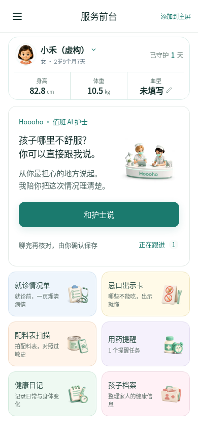
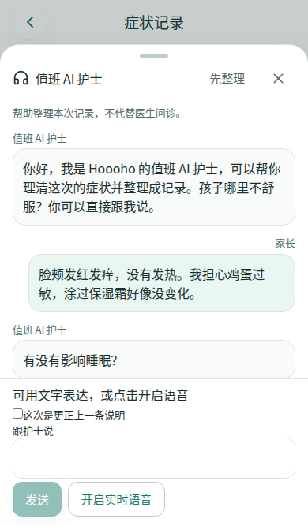

# Homepage nurse conversation — approved compact layout, 2026-10-08

The product owner approved the 390px rearrangement and requested implementation. The child summary is now compact, with the existing 44px avatar, identity switch, age/gender, guarded days, height, weight and editable blood type retained. The original two-nurse video moves from that summary to the right of the nurse invitation. It keeps its original asset and visibility lifecycle. Reduced motion still pauses the video; a homepage-scoped visibility override retains its existing static poster instead of leaving the nurse area blank.

The invitation keeps “和护士说” as the primary action. Its previous “打字聊” action is replaced by “正在跟进” and the current member's active count, using the existing `useHomeFollowUpCount` hook and `/cases` route. The duplicate homepage quick-note/example module is removed. The follow-up second-level page, its “跟进中”/“已康复” tabs, recovery behavior and six homepage feature entries remain unchanged. If count sync fails, the last owned count remains visible with an explicit stale indicator and the list remains accessible; switching members never carries the previous member's count.

The nurse entry still opens the existing `/smart-record` interview with a consumed, account/member-scoped voice intent. The user can choose text inside the nurse panel. Organization, conflict review, attachments and explicit confirmation use the original symptom form and idempotent case-capture API. Direct entry to the existing symptom route still opens its original form. No supplier, model, production dependency, API, database or formal health record is added by opening the page.

## Verification

- Production build and typecheck passed, including body/avatar asset, viewport, auth-build and install checks.
- Full client suite: **588/588** in Asia/Shanghai with test concurrency 2. An initial unrestricted run ended before a summary; the bounded run exposed one historical contract that required the old hero class/layout. That contract was updated to the approved layout and the complete suite passed.
- Mobile browser integration: **24/24** across 320, 375, 390 and 430px: 20 original/adapted cases, plus four count-failure/member-switch cases. The latter's fixture server exited before readiness on two attempts; a subsequent diagnostic run passed all four without application changes.
- After the static-poster refinement, the four affected follow-up/growth/reduced-motion cases were rechecked against the final build.
- Verified the compact child summary and original avatar dimensions, one nurse video in the invitation, no old module or homepage “打字聊”, six retained features, no horizontal overflow, original height route and blood editor, reduced-motion video pause, follow-up status tabs, cached error counts and member isolation.
- Verified denied-microphone fallback to text, conversation retention, organization back to the original form and a single saved fixture record, consumed entry intent, close/reopen/reload behavior and rejection of stale account/member intent.
- All browser writes and AI behavior used the isolated local fixture. **Zero real inference requests** were made. Real supplier audio and physical iPhone Safari microphone behavior were **not retested**.
- `git diff --check` passed. Runtime source changes are limited to the homepage and its nurse invitation; secondary business pages and server code are unchanged.

Commands:

```sh
npm run build
TZ=Asia/Shanghai node --import ./scripts/register-node-ts-loader.mjs --test --test-concurrency=2 'src/**/*.test.ts'
node node_modules/@playwright/test/cli.js test --config tests/ai-nurse/home-entry.config.ts
```

Set `HOOOHO_CHROMIUM_PATH` when using an installed Chromium executable. Browser tests use Asia/Shanghai explicitly.

## Actual application capture

The current layout below is rendered from the actual built application with fictional fixture data. It does not hard-code the product owner's child name, profile or growth values. The existing nurse conversation capture remains a reference for the unchanged secondary flow.




## Release evidence

The initial nurse entry was merged in [PR #348](https://github.com/Hoooho-app/hoooho.app/pull/348). This compact rearrangement starts from main `7dd083f`, preserving the subsequently merged visit-interaction fixes. Commit, main integration, Railway Staging/Production deployment and public version/browser verification are recorded with their actual results in the rearrangement pull request. This pre-release document alone does not assert that the rearrangement is deployed.
