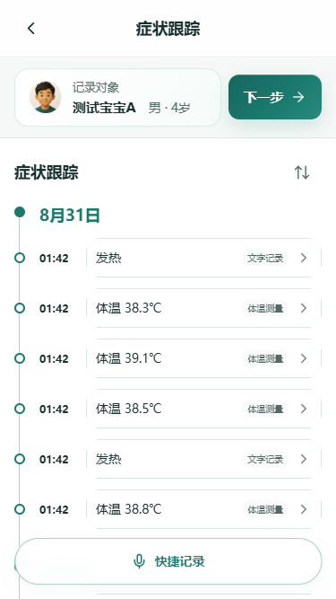
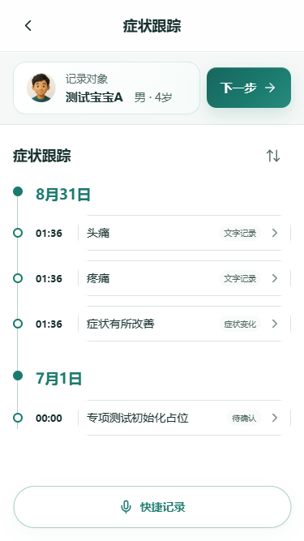
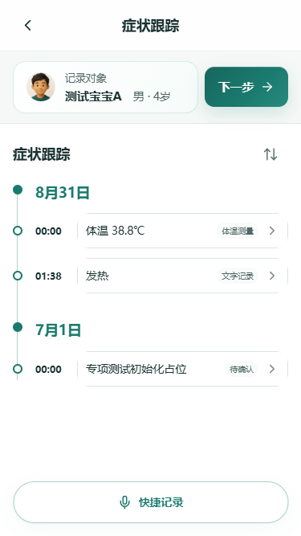
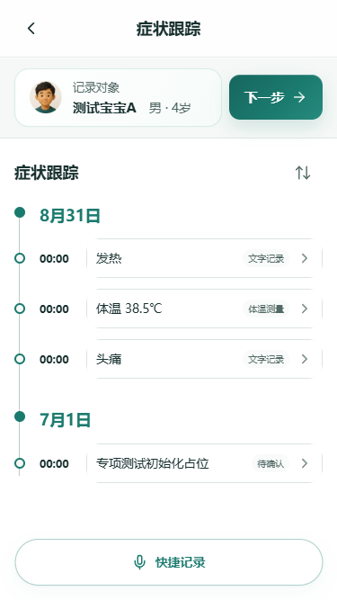

# Hoooho 快捷记录——症状跟踪专项测试报告

## 1. 总结论

**结论：FAIL**

当前版本可以把明确、简单的症状或测量值生成紧凑时间轴记录，文字来源、刷新持久化、单行列表密度和基础防重复表现良好；但它还不能可靠承接真实家庭数天或数周的连续症状跟踪。

阻断上线判断的核心原因：

1. **P0 跨人物污染**：宝宝事件中的“我自己头疼”被写成宝宝的“头痛”。
2. **语义时间在预览到保存之间丢失**：多条 08:00、10:00、12:00、15:00、20:00 记录最终均显示为提交时刻 01:42。
3. **状态变化链不完整**：停止、缓解、持续、纠正和短句复发大量零入库或错误入库。
4. **结构化属性在保存后丢失**：侧别、具体部位、严重程度、频率、次数、持续时长常只剩通用症状名。
5. **无关内容拦截仍有漏洞**：假设句和医疗知识提问被保存为发热事实。

## 2. 测试基线

| 项目 | 实际值 |
| --- | --- |
| 分支 | `codex/symptom-tracking-flow-20260830` |
| 被测 commit | `87dc0ec20cb7097b6fccc544c8621e77eed537bd` |
| 环境 | Railway Staging：`https://hooohoapp-staging.up.railway.app` |
| 自定义 Staging 域名 | `https://staging.hoooho.com` TLS 握手失败，未用于正式执行 |
| 浏览器 | Google Chrome + Playwright 隔离上下文 |
| 设备 | iPhone SE，375×667，竖屏 |
| 时区 | `Asia/Shanghai` |
| 执行时间 | 2026-08-31 01:31–01:51（UTC+08:00） |
| AI Provider | `local-fact-extractor` |
| 测试账号 | Staging 专用虚构账号；与 Production 完全隔离 |
| 测试人物 | 测试宝宝A、测试成人B、测试老人C |
| 测试数据 | 每个正式组使用独立健康事件；初始化占位记录标记为 `fixture-only`，不计成功率 |

右侧 in-app Browser 的安全层不允许向 Staging 注入专用会话，且 Staging 没有邮件验证码服务，因此正式执行改用隔离 Playwright 上下文；页面、静态资源和全部 API 均来自同一 Staging 部署。

## 3. 输入能力与明确排除项

| 能力 | 结果 |
| --- | --- |
| 文字快捷记录 | 已执行，来源均为 `text_record` /“文字记录” |
| 语音快捷记录 | `BLOCKED`：隔离浏览器没有可用真实麦克风输入；未用文字冒充语音 |
| 照片快捷记录 | `BLOCKED`：当前快捷记录入口没有照片能力 |

- “下一步”功能：**未测试、未触碰**。
- 记录编辑、修改和删除：**未测试、未触碰**。
- 智能查看模式和护士导诊台：**未测试、未触碰**。
- 未修改业务代码，未修复测试中发现的问题。

## 4. 执行统计

| 指标 | 结果 |
| --- | ---: |
| 已执行正式用例 | 65 |
| BLOCKED 正式用例 | 11 |
| 实际快捷记录提交 | 105 |
| 成功保存提交 | 78 |
| 安全零入库提交 | 27 |
| 自动化执行错误 | 0 |
| 预览事实数 | 104 |
| 最终新增记录数 | 96 |
| 截图 | 427 张，17.52 MB |
| 平均端到端耗时 | 7.03 秒 |
| P50 | 6.63 秒 |
| 最大耗时 | 20.02 秒 |

严格验收判定：18 PASS / 47 FAIL，**用例通过率 27.7%**。11 个依赖真实音频或照片的用例不进入分母。

## 5. 基础症状用例

| 用例 | 结果 | 实际关键结果 |
| --- | --- | --- |
| ST-01 单一症状 | PASS | 咳嗽、今天，1 条文字记录 |
| ST-02 右侧小腿痛 | FAIL | 仅保留“疼痛/腿”，右侧和小腿粒度丢失 |
| ST-03 严重头痛 | FAIL | 头痛识别，严重程度丢失 |
| ST-04 偶尔咳两声 | FAIL | 仅保留咳嗽，频率丢失 |
| ST-05 呕吐三次 | FAIL | 仅保留呕吐，3 次丢失 |
| ST-06 腹痛两小时 | FAIL | 腹部和持续 2 小时丢失 |
| ST-07 前天出现皮疹 | FAIL | 零入库 |
| ST-08 疑似轻微喘 | FAIL | 零入库 |
| ST-09 约 38–39℃ | FAIL | 零入库 |
| ST-10 鼻塞、咽痛、无发热 | FAIL | 仅保留通用“疼痛”；鼻塞与部位丢失 |
| ST-11 左肩痛、右小腿麻 | FAIL | 仅保留左肩方向的通用疼痛；第二症状和侧别丢失 |
| ST-12 持续咳、呕吐两次 | FAIL | 预览 3 个事实，最终保存“咳嗽、咳嗽持续”，呕吐丢失 |

基础症状实体召回率按最终持久化结果为 **9/15（60.0%）**；基础属性准确率按任务要求字段保守计为 **1/15（6.7%）**。

## 6. 连续症状跟踪

| 用例 | 结果 | 症状过程还原 |
| --- | --- | --- |
| TRACK-01 发热全过程 | FAIL | 数值大体识别，复发状态可见；语义时刻全部落为提交时间，消退步预览 2 事实只保存 1 条 |
| TRACK-02 咳嗽频率 | FAIL | 频率属性不稳定；“睡着后未再咳”零入库 |
| TRACK-03 疼痛评分 | FAIL | 3/6/2 分均未保留；“没继续加重”被解析为加重；最后缓解零入库 |
| TRACK-04 呕吐停止复发 | FAIL | 次数丢失；停止零入库；最后一次未可靠标记复发 |
| TRACK-05 多症状不同方向 | FAIL | 首步 3 个事实只保存 1 条；“晚上没有再发烧”反向生成发热阳性 |
| TRACK-06 部分症状消失 | FAIL | 恶心漏提；呕吐/恶心消失未保留；头痛缓解语义丢失 |
| TRACK-07 疼痛部位变化 | FAIL | 肚脐周围部分保留，右下腹被降级为“腹”；旧部位消失未保留 |
| TRACK-08 左右纠正 | FAIL | 纠正句零入库，时间轴仍显示原错误事实 |
| TRACK-09 持续不变 | FAIL | “没加重”被解析为“当前症状加重” |
| TRACK-10 短暂消失后复发 | FAIL | 昨日无头痛零入库；复发被识别，但中断过程不可追溯 |
| TRACK-11 腹泻频率下降 | FAIL | 5 次、2 次、1 次三步全部零入库 |
| TRACK-12 新症状加入 | FAIL | 首次鼻塞零入库；后续只保留流鼻涕和通用疼痛 |

连续过程还原评分：**32/100**。

截图显示数值点仍在，但 08:00–20:00 的业务时刻全部显示为 01:42，不能还原病程。

## 7. 上下文、否定与纠正

### 上下文

| 用例 | 结果 | 实际 |
| --- | --- | --- |
| CTX-01 “还在” | FAIL | 唯一咳嗽上下文下仍零入库 |
| CTX-02 “轻一点了” | FAIL | 唯一头痛上下文下仍零入库 |
| CTX-03 模糊“这个” | FAIL | 反而保存“当前症状好转”，擅自关联 |
| CTX-04 明确拆分两个症状 | PASS | 头痛消失、腹痛持续拆分为两条 |
| CTX-05 “又有了” | FAIL | 皮疹历史唯一时仍零入库 |
| CTX-06 跨间隔缓解 | FAIL | 零入库 |

可明确关联短句准确率：**1/5（20.0%）**；模糊指代安全率：**0/1（0%）**。

### 否定与纠正

| 用例 | 结果 | 实际 |
| --- | --- | --- |
| NEG-01 无发热 | PASS | 零阳性记录 |
| NEG-02 无发热、持续咳嗽 | PASS | 仅咳嗽相关事实 |
| NEG-03 不完全不咳 | FAIL | 咳嗽保留，偶发频率丢失 |
| NEG-04 没更严重 | FAIL | 零入库，状态不变未保留 |
| NEG-05 左腿改右腿 | FAIL | 整句零入库，最终右腿事实丢失 |
| NEG-06 39.2 改 38.2 | PASS | 只保存 38.2℃ |
| NEG-07 今天早上改昨晚 | FAIL | 仍采用今天早上 |
| NEG-08 不是头痛是头晕 | FAIL | 同时生成头痛阳性与头晕 |

自我纠正准确率：**1/5（20.0%）**；专门否定样本准确率：**3/6（50.0%）**。

## 8. 时间、来源和排序

- “刚刚”记录时间接近实际输入时间。
- “昨晚 23:00”和“昨晚 23:30”未正确持久化，落到提交时间。
- “今天凌晨 1 点”落到当天 00:00。
- 8 月 29 日持续三天的皮疹零入库。
- 周期性夜间头痛最终落到提交时间。
- 保存后时间语义准确率按 TIME 专项严格计为 **1/8（12.5%）**。
- 96 条正式新增记录全部显示“文字记录”，来源准确率 **100%**。
- 刷新后记录数、来源和日期分组保持稳定，持久化成功率 **78/78（100%）**。
- 日期组倒序与同日时间正序在已有数据上稳定，但错误的 `occurredAt` 使排序结果业务上不可信。

## 9. 跨人物污染

### P0：PERSON-02

输入：`宝宝今天发烧38度5，我自己也有点头疼。`

实际在“测试宝宝A”事件中生成：

1. 发热；
2. 体温 38.5℃；
3. 头痛。

成人的头痛被写入宝宝事件，跨人物污染率至少为 **1/96（1.0%）**。PERSON-03 转述疑似发热安全零入库；PERSON-04 宝宝与成人两个独立事件未串写。

## 10. 无关输入拦截

| 用例 | 结果 | 实际 |
| --- | --- | --- |
| FILTER-01 编辑指令 | PASS | 零入库，未进入编辑 |
| FILTER-02 假设明天发烧 | FAIL | 保存发热阳性事实 |
| FILTER-03 医疗知识问题 | FAIL | 保存发热阳性事实 |
| FILTER-04 肺炎担忧 | PASS | 零入库 |
| FILTER-05 天气热 | PASS | 零入库 |
| FILTER-06 背景电视 | BLOCKED | 无真实双声源音频能力 |

无关内容拦截率：**3/5（60.0%）**。

## 11. 交互稳定性和时间轴呈现

- UI-01 双击确认只新增 1 条记录：PASS。
- UI-06 离线提交没有产生记录或重复；恢复后快捷记录可继续使用，但界面直接显示英文技术错误 `Failed to fetch`：FAIL（P2）。
- UI-07 连续两次提交均保留，未串换：PASS。
- UI-08 在每次成功保存后执行刷新，记录数均稳定：PASS。
- 精确重复组 3 组，额外重复事实 3/96，重复记录率 **3.1%**。
- iPhone SE 一屏可展示约 6–7 条单行记录，时间、摘要、标签同行，未出现原始长段文本卡片。

## 12. 专项评分

| 维度 | 得分 |
| --- | ---: |
| 快捷记录输入接收 | 8/10 |
| 症状识别 | 8/15 |
| 属性准确性 | 2/15 |
| 时间解析 | 2/10 |
| 否定与纠正 | 3/10 |
| 状态变化 | 3/15 |
| 上下文关联 | 2/10 |
| 原子化与去重 | 2/5 |
| 时间轴呈现 | 4/5 |
| 安全性 | 1/5 |
| **总分** | **35/100** |

## 13. 缺陷清单

### P0

1. PERSON-02：跨人物头痛写入宝宝事件。

### P1

1. 预览解析出的业务时间在保存时被替换为提交时间。
2. FILTER-02 条件句生成发热事实。
3. FILTER-03 医疗知识问题生成发热事实。
4. NEG-08 明确否定头痛仍生成头痛阳性。
5. TRACK-05 “没有再发烧”生成发热阳性。
6. TRACK-09 “没加重”被反转为症状加重。
7. TRACK-08 侧别纠正零入库，原错误事实仍有效。
8. 多事实预览到保存发生事实丢失，例如 ST-12 丢失呕吐、TRACK-05 首步丢失体温和咳嗽。
9. 停止、缓解、复发与持续状态大量零入库，连续过程不可还原。

### P2

1. 部位、侧别、严重程度、频率、次数和持续时长普遍丢失。
2. 离线提交显示英文技术错误 `Failed to fetch`。
3. 3 个精确重复事实组。
4. 多个用例预览事实数与最终新增记录数不一致，用户无法预知丢失规则。

## 14. 稳定复现步骤

### 跨人物污染

1. 进入测试宝宝A的独立健康事件。
2. 打开“快捷记录”，切换文字记录。
3. 输入“宝宝今天发烧38度5，我自己也有点头疼。”。
4. 自动整理并确认记录。
5. 刷新页面。
6. 实际：宝宝时间轴出现“头痛”。

### 条件句误入库

1. 在干净事件打开快捷记录。
2. 输入“要是明天发烧就麻烦了。”。
3. 自动整理并确认。
4. 刷新后出现“发热”。

### 语义时间丢失

1. 顺序记录 08:00 38.3℃、10:00 39.1℃、12:00 38.5℃、15:00 37.2℃、20:00 38.8℃。
2. 每步保存并刷新。
3. 实际：时间轴全部显示提交时刻附近，而非用户时刻。

## 15. 证据与限制

- 完整本地证据包：`.codex-tmp/symptom-tracking-evidence-20260831.zip`，含 427 张完整手机页面截图。
- 脱敏网络响应和逐步结果：`.codex-tmp/qa-results-*.json`。
- 本报告提交了 11 张关键截图；完整证据包不提交 Git。
- 语音识别、双人背景语音、电视背景音、录音取消和极短音频未执行。
- 照片用例全部因快捷记录无照片入口而 BLOCKED。
- 本轮未运行 Production 写入测试；所有数据仅存在于 Staging 专用账号。

## 16. 最终问题直接回答

- 第一次出现的症状能不能准确记录：**简单症状通常可以，复杂或不确定症状不可靠**。
- 部位、侧别、程度、次数、频率和持续时间是否准确：**否，普遍丢失**。
- “还在”“轻一点”“又有了”能否关联：**不能稳定关联**。
- 能否区分持续、加重、缓解、消失和复发：**仅个别模板能识别，整体不可靠**。
- 否定和自我纠正是否可靠：**不可靠，存在否定反转和纠正失效**。
- 多症状状态是否串联：**会丢失、错误合并或只保留部分事实**。
- 后续记录是否覆盖历史：**未观察到物理覆盖或删除，但状态缺失会让历史过程失真**。
- 同一症状是否重复：**存在 3.1% 的精确重复事实**。
- 不同人物是否污染：**会，已稳定复现 P0**。
- 无关内容和背景语音能否拦截：**文字无关内容拦截率 60%；背景语音未执行**。
- 时间轴能否还原完整过程：**不能；视觉紧凑，但业务时间和状态链不可信**。
- 当前版本是否足以承接真实家庭连续跟踪：**不适合**。

## 17. 下一轮最优先修复建议

1. 先修复主体归属，禁止非当前对象事实进入事件（P0）。
2. 统一预览候选与保存记录的数据契约，保存完整结构化事实、原始来源和 `occurredAt`，不得仅保存简化 `content` 后重新解析。
3. 增加事件级上下文状态模型，显式处理持续、缓解、消失、复发和纠正。
4. 扩充意图门禁，覆盖假设句、医疗知识问题和否定反转。
5. 在上述问题修复后，用同一任务书重新执行真实语音、跨人物音频和完整回归。
